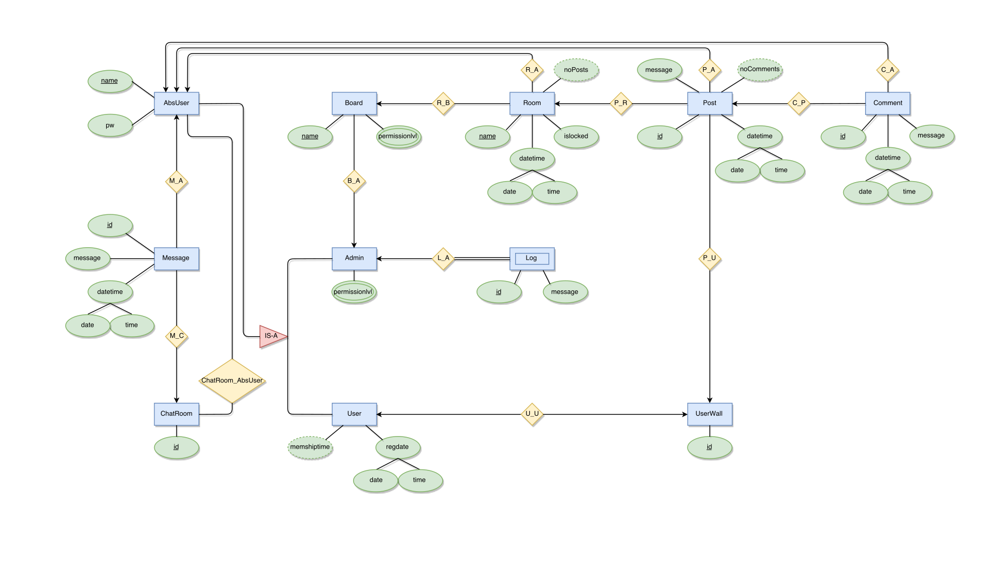

###### Introduction​ ​ to​ ​ Database​ ​ Systems

# Database for a simple forum website

Project by: **Váraljai Péter**

Project Supervisor: **Gábor​ Csaba**

---

## Introduction​

I would like to create a small database to show examples of all types of entities and relationships. I will store the data of a small forum, including useres, admins, their messages, post, and comments. (ect)

## Description

- **Board:**
Figurarly this is the "main menu" every **Room** is listed under different **Board**. It can be created or modified by any **Admin** who has a right permission level.

- **Room:**
**Room**s are attached to **Board**s. Every **Room** contain different **Post** from different **User**s. It can be created by any **User**. It has creation time, and it can be locked by any **Admin**.

- **Post:**
**Post** are attached to **Room**s or **UserWall**s. Users can **Comment** any **Post**s (except if the **Room** is locked).
It has creation time, belongs to an **User**, and contains a message.

- **Comment:**
Every **User** can **Comment** their/other **User**s **Post**.
It has creation time, belongs to an **User**, and contains a message.

- **ChatRoom:**
**Chatroom**s are automaticaly created rooms where **User**s and **Admin**s can send **Message**s to each other.
Multiple **User**s can be in the same **ChatRoom**, and **User**s can be in multiple **ChatRoom**s.

- **Message:**
Every **User** can send **Message**s to other **User**s are in the same **ChatRoom**.
It has creation time, belongs to a **User**, and contains a message.

- **AbsUser:**
This is the abstract user. It stores username and hashed and encrypted password.

- **User:**
This is an ISA subclass of AbsUser. It has registration date and **UserWall**.

- **Admin:**
This is an ISA subclass of AbsUser. It has permission level, and a **Log**ger.

- **UserWall:**
This is belongs to a **User**. Other **User**s can **Post** their opinions here.

- **Log:**
This is a weak table. It is belongs to an **Admin** and cointains every modifications an **Admin** done.

## E/R Diagramm

###### work in progress

