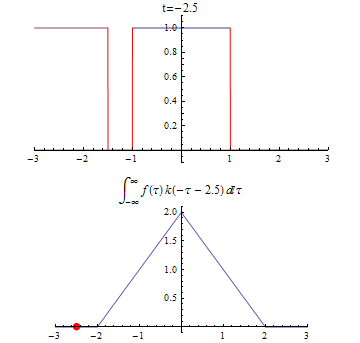

# 03.09 Gyak

## Fourier transzformáció

$$ X(f) = \int_{-\infty}^{\infty} x(t) * e^{-j 2 \pi ft} dt $$

$$ x(t) = \int_{-\infty}^{\infty} X(f) * e^{-j 2 \pi ft} dt $$

### Tulajdonságai:

- Lineáris
- Időeltolás
- Modoláris
- Skálázás $$ F(x(m*t)) = 1/|m| * X(f/m) $$
- konvolúció $$ F(x(t)¤h(t)) = X(f) * H(f) $$
- Derivált $$ F(x'(t)) = j \omega * X(f) $$
- Parsevált t. $$ \int_{-\infty}^{\infty} x^2(t) dt = \int_{-\infty}^{\infty} X^2(f) df $$

### Jellemzők:

valós x(t)    -> |X(f)| páros
páros x(t)    -> Re X(f)
páratlan x(t) -> Im X(f)

## DirachDelta

$$ \delta(t=0) = \infty $$
$$ \delta(t \neq 0) = 0 $$

### Példa

$$ F(negyszogjel_{-T/2}^{T/2}) = lim_{T->0} \frac{sin(\pi f T)}{\pi f T} = 1 $$

$$ F( sin(2 \pi f_0 t) ) = F( \frac{e^{j 2 \pi f_0 t} e^{-j 2 \pi f_0 t}}{2j} ) = 1/2j (\delta(f-f_0) - \delta(f+f_0) ) $$

## Analóg - Digitális áalakítás

### Sávszélesség

#### Abszolút sávszélesség \\( B_0 \\)

#### \\( \epsilon \\) sávszélesség:  \\( B_{\epsilon} \\)

\\( 0 < \epsilon < 1 \\)

def: \\( 1/\sqrt(1) \\)

\\( \epsilon \\) nő -> \\( B_{\epsilon} \\) csökken

#### Energia sávszélesség \\( B_{\eta} \\)

\\( 0 < \eta < 1 \\)

def: \\( 0.9 \\)

\\( \eta \\) nő -> \\( B_{\eta} \\) nő

#### Zaj definiált sávszélesség def: \\( B_{N} \\)


## ADC

### A/D átalakítás

#### mintavételezés x(t) -> x(k)

\\( f_s = 1/T_s \\)

ha \\( f_s >= 2 B \\) akkor a visszaállítás veszteség mentes: \\( x(t) = \sum_k h(t-k * T_s) \\) ahol \\( h(t) = T * \frac{sin(2 \pi B t)}{2 \pi B t} \\)

##### Példa

x(t) = 2 * sin( 2 pi 10 t ) + cos( 2 pi 20 t)

B = 20hz

**Betartva az f_s >= 2 B**

f_s = 50hz

T_s = 1/f_s = 0.02sec

x(0) = 1
x(1) = 2 * sin(0.4 pi) + cos(0.8 pi)
...

**Nem betartva az f_s >= 2 B**

f_s = 35hz

x(0) = 1
x(1) = 2 * sin(0.4 pi) + cos(0.8 pi)
...

**Pont f_s = 2 B**

x(t) = sin(2 pi * 10 t)

f_s = 20hz

T_s = 0.05

0-kat mintavételezek

ha lenne fázisa: x(t) = sin(2 pi * 10 t + l) vissza lehetne állítani ha ismerjük a fázist (l)

nincs 10hz-s sin, csak megközelítőleg, ezért közel lesz egymáshoz minta és "lebegés lesz"


#### kvantálás x(k) -> x˘(k)

-C és C között \Delta = (2C)/N ahol N = 2^n;

kvantálás = kerekítés a legközelebbi jelszinthez

Olyan ez mintha zajt adnánk a jelhez: minden mintaponthoz egy "véletlen" hozzáadás/kivonás a kerekítés.

A zaj energiát csökkenthetjük.


#### kódolás x˘(k) -> bináris

### DSP

### D/A


### Stohasztikus jel

$$ R(z) = E( \mu(t) * \mu(t-z) ) $$

$$ \int_{-\infty}^{\infty} R(z) * e^{-j 2 \pi f} dz $$ 

- Termikus zaj

# 03.03 Elő

## A/D átalakítás

analóg -> [A/D] -> digitális lehető legrövidebb reprezentáció az adott hűségkritériummal (adatátviteli sebesség)

### Folyamat:
- Folytonos jel forma
- Mintavételezés: (pálcikák) $$ f_s = 1/T $$ 
- Qvantáló (dizskrét ÉT, ÉK)
- Kodolás (bináris)

## Mintavételezés

$$ x(t) = \int_{_B}^{B} x(f) e^{j 2 \pi ft} df $$ 

$$ X_{\epsilon} = x(t_0 + \epsilon * T) = \int_{_B}^{B} x(f) e^{j 2 \pi f \epsilon T} df $$

$$ X_m(f) =  \sum_{k=-\infty}^{\infty} x(f + k/T) \, Ha: 1/T \geq 2B $$

## Gyakorlati mintavételezés

A mintavételezés alapját képző pillanatszerű érték-vételezés a gyakorlatban nemteljesülhet,mivel nincs olyan kapcsoló, mely képes lenne csupán egyetlen pillanatban mintát venni a jel-ből. Ehelyett a kapcsoló a mintavételezés során nagyon rövid ideig tartó mintákat vesz, ésennek átlagát tekinti az adott időpillanathoz tartozó mintának. Ha figyelembe vesszük azt, hogy túlmintavételezés esetén, vagyis amikor \\( f_s>2B \\), több adatkeletkezik, melynek továbbításához nagyobb sávszélesség kell, akkor felvetődik a kérdés,hogy miért nem a lehető leggazdaságosab \\( f_s = 2B \\) mintavételi frekvenciamellett történik amintavételezés. A válasz erre az, hogy az \\( f_s = 2B \\) frekvenciával mintavett jel analóg átalakításához a \\( H(t) \\) aluláteresztő szűrőnek ideálisnak kéne lennie, ilyet pedig a gyakorlatban nemlehet megvalósítani.


## Qvantálás

A kvantálás feladata, hogy a mintavett jelet a kvantálási szinteknek megfelelő, digitálisan isértelmezhető jellé alakítsa, mégpedig úgy, hogy az egyes mintákat a legközelebbi kvantálásiszintre kerekíti.

### Jel-zaj viszony

A jel-zaj viszony (Signal-to-Noise Ratio, SNR) két teljesítmény jellegű mennyiség hányadosaként azt fejezi ki, hogy hogyan viszonyul a jel teljesítménye a háttérzajhoz:
$$ SNR = (\frac{P_{jel}}{P_{zaj}}) = (\frac{A_{jel}}{A_{zaj}})^2 $$
$$ SNR_db = 10log (\frac{P_{jel}}{P_{zaj}}) =  20log (\frac{A_{jel}}{A_{zaj}}) $$

#### Egyenletes

Tegyük fel, hogy a kvantálás −C és C közöttijelszintekre történik, mégpedig ezt a szakaszttöbb részre osztva, úgy, hogy az osztópontok közti távolság \\( \Delta \\). Ez azt jelenti, hogy \\( N=\frac{2C}{\Delta} \\) darab kvantálási szint van. 

$$ P_jel = \frac{C^2}{2} $$
$$ P_zaj = \frac{\Delta^2}{12} $$

Ebből következik:

$$ SNR = 3/2 *2N^2 $$

#### Nem egyenletes közi qvantálás
    
$$ SNR = \frac{3N^2}{C^2} \frac{\int_{-C}^{C} x^2 p(x) dx }{ \int_{-C}^{C} \frac{1}{l^{12}(x)} dx } = J(l(x)) $$

### Differenciál qvantálás

...


# 03.02 Gyak

$$ LTI(x(t))=y(t) $$

rendszer->hálózat: szintézis

hálózat->rendszer: analízis

- idő tartomány
    - analízis 
    - diff e 
    - x(t) -> y(t)
- frekvencia tartomány
    - Fourier transzformáció (nagybetűvel jelöljük)

$$ \omega=2*\pi*f $$


## Folytonos konvolúció
 
### Példa

$$ x(t) = negyszogjel_{-T/2}^{T/2}(1) $$

$$ h(t) = x(t) $$

$$ y(t) = x(t) ¤ h(t) = \int_{-\infty}^{\infty} x(\tau)-h(t-\tau), d\tau) $$

$$ y(t) = harmoszogjel_{-T/2}^{T/2}(T) $$



## Szűrők

``` 
    o--r---+---o
           c
    o------+---o
```

$$ u_r=r*i_r $$

$$ i_c=C*u_c $$

$$ i_r-i_c=0 $$

$$ u_r+u_c=0 $$


## Lapace transzformáció

$$ X(s) = \int_{-\infty}^{\infty} |x(t)*e^{-dt}|^2 dt $$

## Komplex impulzus válasz

$$ H(\omega) = |H(\omega)| * e^{j*arc(H(\omega))} $$

$$ arc(H(\omega))=tg(\frac{im(H(\omega))}{re(H(\omega))}) $$

| $$ \omega $$           | $$ H(\omega) $$     | $$ 10lg(H(\omega)) $$ | $$ arc(H(\omega)) $$ |
|--|--|--|--|
| 0                      | 1                   | 1                     |0˙                    |
| $$ \omega=\omega_0 $$  | $$ \frac{1}{1+j} $$ | $$ \frac{1}{2*\pi} $$ | -45˙                 |
| $$ \omega>>\omega_0 $$ | 0                   | 0                     | $$ -\infty $$        |

## Fourier transzformáció

### Jelek dekopozíciója

Időtartomány: x(t)

Transzformált tartomány(ok): Fourier, Lapace, stb

### Fourier sorfejtés:

$$ x(t) = \sum_{k=-\infty}^{\infty} C_k * e^{k * 2 \pi * F_0 * k * T} $$

$$ C_k = \frac{1}{T} * \int_T x(t) * e^{-j * 2 * \pi * F_0 * k * t}  |  F_0 = \frac{1}{T} $$

### Fourier transzformáció

$$ X(f) = \int_{-\infty}^{\infty} x(t) * e^{-j * \omega * t} dt $$

$$ X(\omega) = \int_{-\infty}^{\infty} x(t) * e^{-j * \omega * t} dt $$

### Inverz Fourier transzformáció

$$ x(t) = \int_{-\infty}^{\infty} X(f) * e^{j * 2 * \pi * f * t} df $$

$$ x(t) = \int_{-\infty}^{\infty} X(\omega) * e^{j * \omega * t} dt $$

#### Példa

$$ x(t) = negyszogjel_{-T/2}^{T/2}(1) $$

## Fourier transzformáció tulajdonságai

- Lineáris: $$ F(\sum \lambda_i * x_i(t)) = \sum \lambda_i * F(x_i(t)) $$
- Időeltolás: $$ F(x(t-T)) = e^{-j * 2 * pi * f * T} * X(f) $$
- Moduláció: $$ F( x(t) * e^{-j * 2 * pi * f * T} ) = X(f-f_0) $$

# 02.23 Gyak

### Olah András

- olaha@itk.ppke.hu
- 409 szoba

### Vizsga

- Írásbeli
- Szóbeli

### Pluszpontok

- Olah andrásnak is küldjük mert ő dokumentálja

---

## Folytonos rendszerek

    Benement->Rendszer->Kimenet

    explicit: y(t)=Đ{x(t)}
    implicit: Đ{y(t),x(t)}=0

    lineáris:
        Ha érvényes rá a szuper pozíció elve

    időinvariáns:
        Nem függ az időtől
        y(t)=Đ{x(t)} -> y(t-A)=Đ{y(t-A)}

    kauzalitás:
        y(t=t`) = Đ{x(t),y(t),-oo<t<t`}

    stabil:

    hálózat és rendszer
        A hálózat is rendszer, csak a rendszernél nem kell tudni mi van benne.

    rendszer szintézis:
        hálózat->rendszer

    rendszer analízis
        rendszer->hálózat


    Lineáris időinvariáns (+passzív) rendszerek

        komponensek
            explicit
            implicit

            pl:
                ellenállás
                    u[R](t)=i[R](t)/R
                kapacitás
                    i[C](t)=C*u`[C](t)
                tekercs
                    u[L](t)=L*u`[L](t)
                dioda (nem lineáris | időinvariáns)
                    z[D](t)=i[0] * e^(u[D]/i[D])
--------------
1) Rendszer analízis
    áramkör e + komp k = diff e = rendszer e

    [[ 
        o--r1---+---r2----+---o
       x(t)     c1        l1
        o-------+---------+---o
    ]]

    Egyenletek:
        u[r1]=r1*i[r1]
        stb
    
    Kirchoff törvények:
        Csomóponti:
            i[r1]-i[r2]-i[c]=0
            i[r2]-i[l]=0
        Hurok:
            u[r1]+u[c]-u[l]=0
            u[r2]+u[l]-u[c]=0

    Diff egyenlet rendszer:
        u[c]`= -u[c]/(r1*c) - i[l]/c + u(x)/(r1*c)
        u[l]`= -u[c]/l - (r2*il)/c
    
    Diff egyenlet:
        l*i[l]`` + (r2 + l/(r1*c) )*i[l]` + (r2/(r1*c) + 1/c ) *i[l] + u(x)/(r1*c) = 0

---------

2) Vizsgáló jelek rendszere:
    DirachDelta =   | +oo ha t=0
                    | 0   def

    x(t) = int(-oo,+oo, x(Tau)*DirachDelta(t-Tau), dt)

    y(t) = Đ{x(t)} = Đ{ int(-oo,+oo, x(Tau)*DirachDelta(t-Tau), dt) } = int(-oo,+oo, x(Tau)*Đ{DirachDelta(t-Tau)}, dt) 
         = int(-oo,+oo, x(Tau)*h(t-Tau), dt)
         = x(t) ¤ h(t) -- ahol a '¤' az konvolúció

------------

3) Analízis a ferkvencia tartományon
    Jelek dekopozíciója

    Fourier transzformáció
        x(f) =  int(-oo,+oo,x(t)* e^(-j*2pi*f*t), dt)
        x(t) = 1/2pi * int(-oo,+oo,x(f)*e^(j*2pi*f*t, df)

    A konvolúció a ferkvencia tartományon szorzás

    Szűrők
        Alul áteresztő (felül vágó)  [[__--__]]
        Felül áteresztő (alul vágó)  [[--__--]]
        Sáv vágó              [[---__---__----]]
        Sáv áteresztő         [[-__---__---__-]]
        Mindent áteresztő     [[--------------]]

--[[02.16
]]

Követelmény:
    4 kis ZH
    1 Nagy ZH
    1 VizsgaZH
    Gyakjegy+Vizsgajegy=Jegy

Megajánlott:
    Legalább 4es kis és nagy ZH-k

------

1) Véges tartalmú jel: x(t)~=0 ha t: [A;B]
2) Belépő jel: x(t)~=0 ha t>=0
3) Abszulut integrálható: int(-oo,+oo,|x(t)|,dt) < +oo
4) Véges energiájú jel: int(-oo,+oo,x(t)^2,dt) < +oo
5) Véges átlag energiájú jel 1/T * int(-T/2,T/2,x(t)^2,dt) < +oo

6) Speciális jelek:
    Dirach delta
    Egy ugrás
        x(t)=0 ha t<0 
        x(t)=1 ha t>0
    Egység sebesség ugrás
        x(t)=t

7) Periodikus jelek:
    x(t)=x(t+ET)
    f = 1/T ; x(t)=sum(k=-oo,+oo,C[k]*e^(-j*2pi*f*k*t) ) ; C[k] = 1/T int(-T/2,T/2,x(t)*e^(-j*2pi*f*k*t), dt) 

8) Fourier transzformáció
    int(-oo,+oo,x(t),dt) < +oo ; int(-oo,+oo,x(t)*e^(j*2pi*f*k*t), dt)
    x(f) =  int(-oo,+oo,x(t)* e^(-j*2pi*f*k*t), dt)

    int(-oo,+oo,x^2(t),dt) = int(-oo,+oo,|X(f)|^2,df)

9) Lapace transzformáció
    int(-oo,+oo,x(t)*e^(-A*t), dt) < +oo;
        -> int(-oo,+oo,x(t)*e^(-A*t)*e^(-j*2pi*f*k*t), dt) = int(0,+oo,x(t)*e^(-s*t), dt) = X(s)

10) Lineáris Időinvariáns rendszerek (LTI)
    x(t)->[LTI]->y(t)

    DirachDelta(t)->[LTI]->h(t) - Impulzus válasz fv