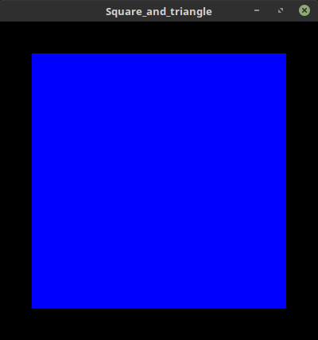
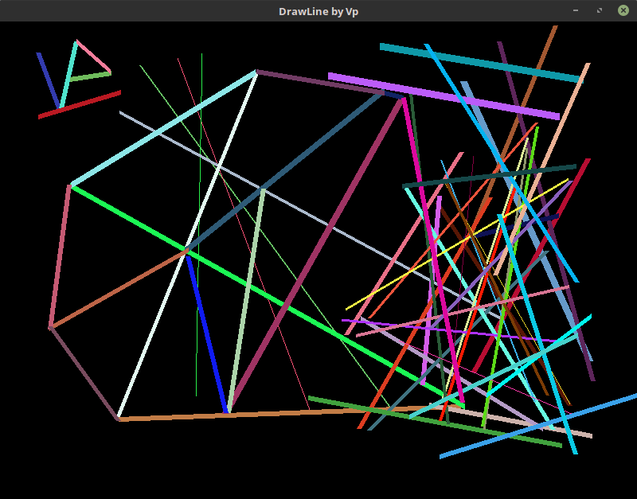

###### Váraljai Péter
# 1. feladat:

- A megadott keretrendszer értelmezése után, létrhoztam egy boolean _kockaharomszog_ globális változót. 
- Ezután megírtam hogy a _h_ lenyomására false, az _n_ lenyomására true értéket vegyen fel. 
- A kirajzolásnál pedig egyszerű esetszétválasztással a már meglévő zöld háromszöget, vagy a GL_POLYGON-ként kirajzolt kék négyszöget rajzoltattam ki.



# 2. és 3. feladat:
    
- A megadott keretrendszer picit lecsupaszítottam, és átalakítottam.
- Létrhoztam régi kódjaimból egy env.hpp könyvtárat, ami 3d-s _koordináta_ osztály leképzéssel és traszformációkkal. Ezt kiegészítettem hogy legyen egy _szín_ (rgb) és egy vonal osztály (2 koordináta, vastagság, szín)
- Megírtam hogy egy _vonalak_ vectorban tárolt (pointer) vonalakat kirajzolja a _ReDraw()_ függvény az adott színnel és vastagsággal.
- Specifikáltam a keybindeket. _c_ képernyő törlés, _z_ utolsónak rajzolt vonal törlése. _ESC_ kilépés. És hogy a vastagságot a számokkal lehessen állítani: ```c++ if (key>48 and key<60) vastag=key-48;```
- Az egér kezelésnél a bal egérgombal kezdtem: gomb lenyomásra létrhoz egy véletlen színű, beállított vastagságú vonalat, aminek az egyik koordinátája a kattinás kezdtetekor, a másik a felengedés pillanatában lévő egér koordinátái. A _Motion_ fügvénnyel az egyenes vonalat folyamatosan rajzolja.
- Ezután a jobb egérgombal folytattam: létrehoztam egy függvényt amely visszatér az adott koordinátához legközelebb eső vonal közelebbi csúcsával (pointer). Ennek segítségével bárhová át lehet helyezni a vonalat, amely áthelyezés közben is folyamatosan újrarajzolódik.


